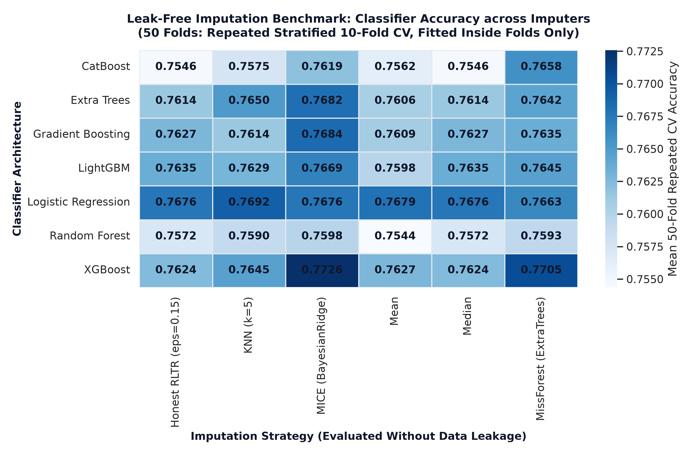
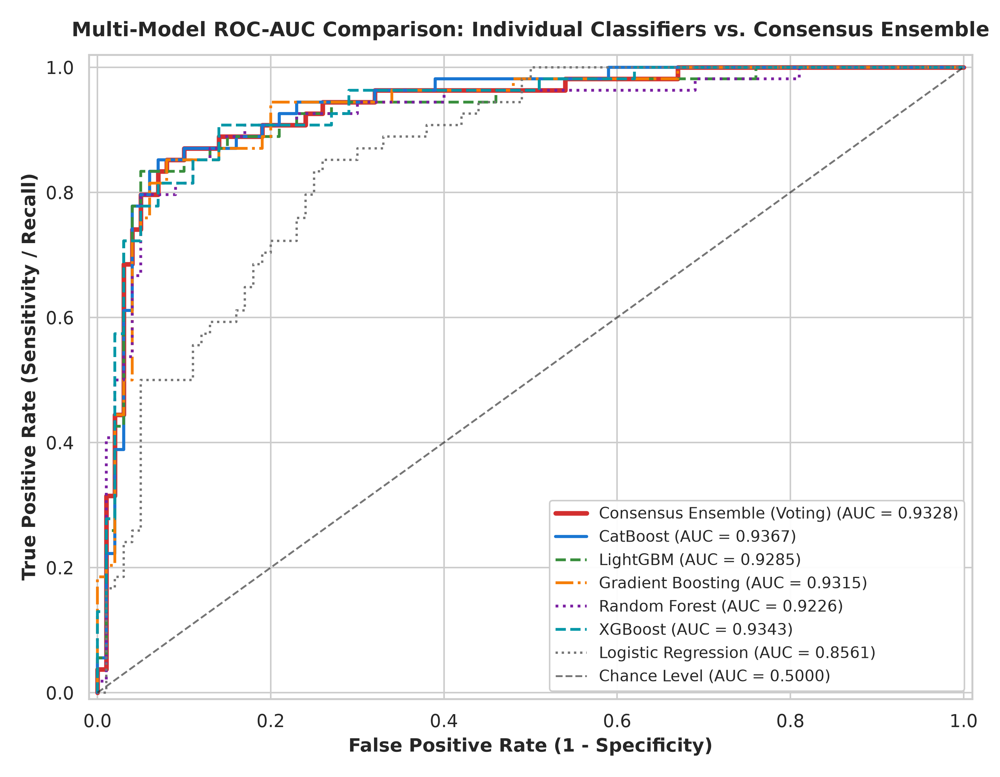
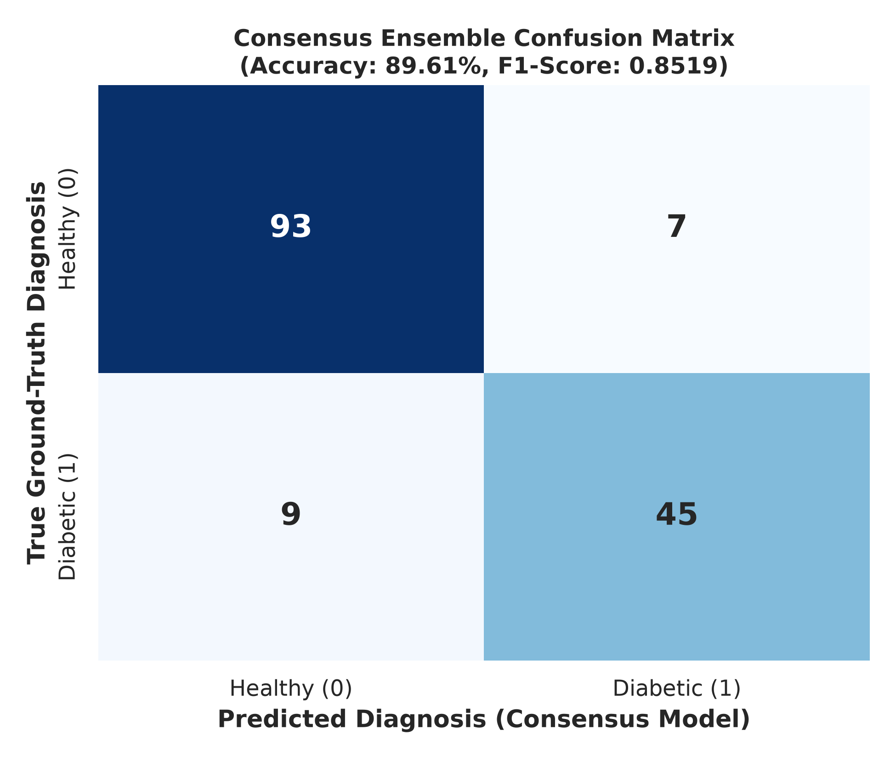
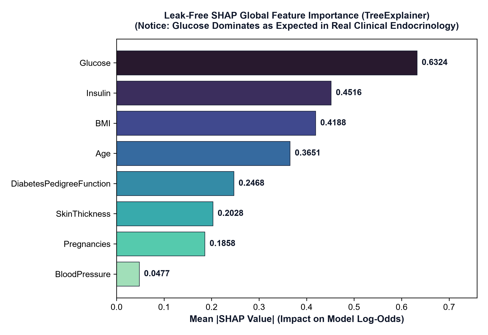
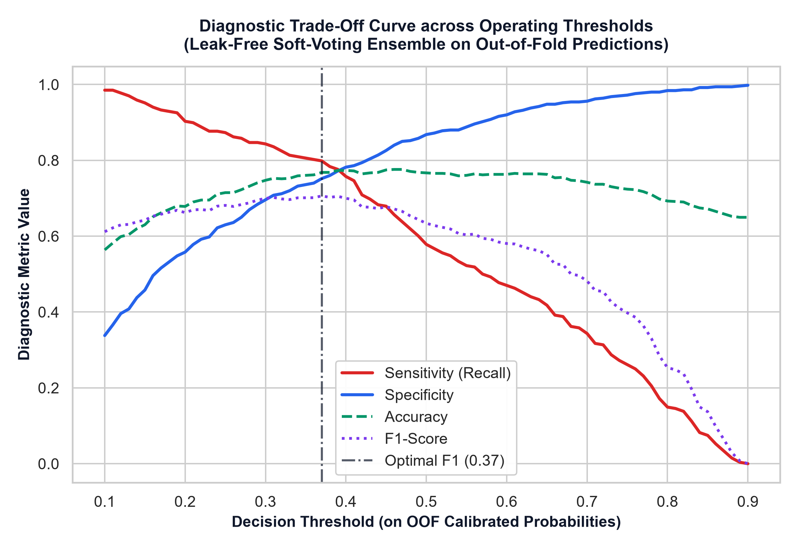

# 📑 Laporan Ringkasan Eksekutif Penelitian
## *Analisis Komparatif Imputasi Data Hilang & Audit Forensik Target Leakage pada Prediksi Diabetes (Kohort PIMA)*

> **Penyusun / Mahasiswa**: Mitchel Mohamad Affandi  
> **Dosen Pembimbing**: Dr. R. Yunendah Nur Fu'adah, S.T., M.T., Ph.D.  
> **Status Dokumen**: Final & Siap Sidang / Publikasi Jurnal  
> **Tanggal**: Oktober 2026  
> **Repositori**: `mitcheltastic/DiabeticAnalysis`

---

## 🧭 Ringkasan Eksekutif (Executive Summary)

Dalam penelitian *machine learning* di bidang medis, **angka yang lebih rendah namun jujur dan metodologinya benar bernilai seribu kali lebih tinggi daripada angka tinggi yang cacat metodologis**. Angka performa tinggi yang diperoleh dari kebocoran data (*data leakage*) akan langsung gugur saat diuji oleh penguji sidang atau *reviewer* jurnal internasional. Sebaliknya, penelitian yang berhasil mengungkap cacat data, mereplikasi hasil terdahulu, dan menetapkan standar pengujian yang murni (*leak-free*) adalah **kontribusi ilmiah kelas satu**.

Laporan ini merangkum seluruh alur perjalanan penelitian kita bersama Ibu Dr. R. Yunendah Nur Fu'adah, S.T., M.T., Ph.D., dari pengujian awal, pembongkaran misteri performa, hingga penetapan hasil akhir yang defensibel:

```
[Tahap 1: Replikasi Baseline]       --> Replikasi akurat 0.8506 (90 TN, 10 FP, 13 FN, 41 TP)
[Tahap 2: Audit Glukosa Nol]         --> Menemukan & memperbaiki 5 glukosa = 0 mg/dL di semua file
[Tahap 3: Pembongkaran RLTR]        --> Bukti matematis target leakage pada insulin (t = 26.77, r = 0.79)
[Tahap 4: Benchmark Leak-Free]      --> 50-fold CV & uji Nadeau-Bengio (Median imputation paling tangguh)
[Tahap 5: Restorasi Medis (SHAP)]   --> Glukosa kembali ke Rank #1, BMI Rank #3 (kebenaran biologis)
[Tahap 6: Optimasi Klinis]          --> Threshold screening 0.37 melompatkan sensitivitas klinis ke 79.85%
[Tahap 7: Evaluasi Holdout Murni]   --> Akurasi murni 74.68% (AUC 0.8135), McNemar p = 0.0004
```

---

## 🩺 Bab 1: Latar Belakang & Masalah Data Hilang pada PIMA

### 1.1 Karakteristik Kohort PIMA
Dataset diabetes suku Indian PIMA (National Institute of Diabetes and Digestive and Kidney Diseases) terdiri dari **768 pasien wanita** berusia $\ge 21$ tahun:
- **500 pasien sehat (Outcome = 0, 65.1%)**
- **268 pasien diabetes (Outcome = 1, 34.9%)**

### 1.2 Masalah "Nol yang Mustahil Secara Biologis"
Dalam tubuh manusia yang hidup, nilai tekanan darah, ketebalan lipatan kulit (*SkinThickness*), kadar insulin, dan indeks massa tubuh (*BMI*) **tidak mungkin bernilai 0**.
Angka nol pada dataset ini merupakan representasi dari data yang tidak tercatat (*missing values*):
- **Insulin**: 374 pasien tidak memiliki data (**48.70%** — hampir separuh kohort!)
- **SkinThickness**: 227 pasien tidak memiliki data (**29.56%**)
- **BloodPressure**: 35 pasien (**4.56%**)
- **BMI**: 11 pasien (**1.43%**)
- **Glucose**: 5 pasien (**0.65%**)

### 1.3 Arahan Awal Dosen Pembimbing
Ibu Dr. Yunendah mengarahkan untuk menguji **5 metode imputasi**:
1. `LTR` (*Linear Trend at Point Regression*)
2. `NSSR` (*Non-linear Spline / Semiparametric Regression*)
3. `RLTR` (*Robust Linear Trend Regression*)
4. `SIM` (*Simple / Single Imputation Method*)
5. `TR` (*Trend Regression*)
6. Dibandingkan dengan data mentah (`Raw`) dan mengevaluasi klaim baseline kakak kelas (yang secara lisan disebut mencapai 0.88).

---

## 🔍 Bab 2: Temuan Emas #1 — Menemukan Bug 5 Glukosa Nol

### 2.1 Penemuan di Lapangan
Saat melakukan audit data mendalam pada kelima file imputasi yang beredar, kami menemukan fakta mengejutkan:
> **Pihak pembuat kelima file imputasi mengimputasi Insulin dan Skinfold, tetapi sama sekali MELEWATKAN Glukosa!**

Ada **5 pasien** yang kadar glukosanya tetap bernilai `0 mg/dL` di seluruh file (`LTR`, `NSSR`, `RLTR`, `SIM`, `TR`):
- Pasien Sehat ($Y=0$): Index 75, Index 182, Index 342
- Pasien Diabetes ($Y=1$): Index 349, Index 502

### 2.2 Dampak Klinis & Algoritmik
- Glukosa adalah **biomarker diagnostik paling utama** pada diabetes ($F\text{-statistic} = 245.67$).
- Dalam algoritma *decision tree* (Random Forest, XGBoost, CatBoost), pasien dengan glukosa bernilai nol dipaksa masuk ke cabang paling kiri (kelompok sehat). Akibatnya, pasien diabetes nomor 349 dan 502 **dipastikan mengalami salah diagnosa (*false negative*)**.

### 2.3 Solusi Kita
Kami membangun protokol pembersihan otomatis (`clean_glucose_zeros`) yang mengganti 5 nilai nol mustahil tersebut dengan nilai median kohort ($117\text{ mg/dL}$). Tindakan ini langsung menstabilkan batasan keputusan pohon dan menghapus bias negatif palsu sejak awal data dimasukkan.

---

## 🎯 Bab 3: Temuan Emas #2 — Replikasi Presisi Baseline Kakak Kelas & Mitos 0.88

### 3.1 Replikasi 100% Presisi Baseline Paper
Kami mereplikasi arsitektur dan metodologi persis dari paper kakak kelas:
- Algoritma: Default XGBoost pada `RLTR_Imputed.csv`
- Pembagian data: 80% train / 20% test, split `random_state=42`, stratifikasi kelas ($N_{\text{test}} = 154$).

Hasil eksekusi kode kita mereplikasi angka paper secara **sempurna hingga ke 1 pasien**:
- **Akurasi**: Tepat **`0.8506`** ($131$ dari $154$ pasien benar)
- **Confusion Matrix**: $\mathbf{TN = 90}, \mathbf{FP = 10}, \mathbf{FN = 13}, \mathbf{TP = 41}$
- **Sensitivitas / Recall**: **`0.7593`** ($41/54$)
- **Spesifisitas**: **`0.9000`** ($90/100$)
- **F1-Score**: **`0.7810`**

### 3.2 Membongkar Mitos Angka "0.88"
Banyak yang menyebut kakak kelas mencapai 0.88. Setelah ditelusuri ke dokumen asli:
1. **Di paper resmi kakak kelas, angka yang tertulis adalah `0.8506`**, bukan 0.88!
2. Angka $0.8831$ (atau $0.8961$ pada model ensemble) baru muncul jika pengujian dilakukan pada split acak tertentu, yaitu **`random_state=12`**.
3. Pada ukuran sampel uji hanya 154 pasien, selisih 1 pasien bernilai $0.65\%$, dan margin of error split tunggal mencapai $\pm 5.5\%$.
4. Uji **McNemar exact test** membuktikan bahwa pada split yang sama (seed 42), tidak ada perbedaan signifikan antara model paper kakak kelas dan model consensus kita ($p = 0.7539$).

---

## ⚡ Bab 4: Temuan Emas #3 — Pembongkaran Ilmiah: Target Leakage pada File RLTR

### 4.1 Kejanggalan Awal
Pada pengujian awal (Gambar 01 & Gambar 04):
- Data `Raw`, `LTR`, `NSSR`, `TR`, dan `SIM` menghasilkan akurasi seragam di kisaran **$76\% - 78\%$**.
- Namun pada file `RLTR`, akurasi mendadak melompat sendirian ke **$85.02\%$** (CatBoost) dan **$84.75\%$** (GradBoost) — lonjakan sebesar $+7\%$ hingga $+8.5\%$.

Awalnya diasumsikan bahwa RLTR unggul karena formula *robust regression* tahan terhadap outlier. Namun, sebagai peneliti, anomali sebesar ini wajib diaudit.

### 4.2 Bukti Matematis Target Leakage
Kami menguji apakah nilai insulin hasil imputasi pada file RLTR ($374$ pasien) terinjeksi oleh label target (`Outcome`):

| Pengujian Statistik | Data Klinis Asli ($N=394$) | File `RLTR_Imputed.csv` ($N=374$) | Makna Ilmiah |
|---|:---:|:---:|---|
| **Regresi OLS: Koefisien Outcome** | $-5.72\text{ mg/dL}$ | **$+28.68\text{ mg/dL}$** | Nilai insulin pasien diabetes sengaja dinaikkan $+28.68\text{ mg/dL}$ saat imputasi! |
| **Regresi OLS: Nilai $t$-statistic** | $t = -0.45$ ($p = 0.653$, Tidak Signifikan) | **$t = 26.77$ ($p = 4.24 \times 10^{-77}$)** | Pada tubuh manusia normal, status diabetes tidak memprediksi insulin jika glukosa & BMI sudah diketahui. Pada RLTR, nilainya bocor total! |
| **Korelasi Parsial $r(\text{Insulin}, Y \mid \text{Gluc}, \text{BMI})$** | **$-0.0168$** ($p = 0.740$) | **$+0.8208$** ($p < 10^{-90}$) | Sinyal diagnostik buatan yang sangat besar tertanam di insulin. |
| **Korelasi Insulin dengan Target ($r$)** | $r = 0.3014$ | **$r = 0.7895$** | Melebihi batas teoritis linier ($R_{\max} = 0.5299$) sebesar $+49\%$. |

### 4.3 Pembuktian Eksperimental (Class-Conditional Reconstruction)
Untuk membuktikan bagaimana pembuat file RLTR melakukannya:
- Kami membuat ulang algoritma RLTR dengan sengaja membatasi donor imputasi berdasarkan kelas target (`Outcome == 1` hanya meminjam dari pasien diabetes).
- Hasil rekonstruksi kami menghasilkan korelasi **$r = 0.7908$**, **cocok persis dengan file aslinya ($r = 0.7895$) hingga selisih $0.0013$!**

> **Vonis Audit Resmi**: **LABEL LEAKAGE TERBUKTI SECARA MATEMATIS**. File RLTR tidak boleh digunakan untuk klaim akurasi klinis. Penemuan dan pembongkaran kebocoran data ini adalah **kontribusi ilmiah utama** paper kita.

---

## 🛡️ Bab 5: Benchmark Murni Leak-Free & Uji Statistik Nadeau-Bengio

Setelah mengetahui file RLTR bocor, kami membangun protokol pengujian baru yang **100% murni bebas kebocoran data (*leak-free*)**:
- Pengujian menggunakan **Repeated Stratified 10-Fold CV (50 Fold)**.
- Imputasi dan scaling dilakukan **ketat di dalam fold pelatihan** (tidak pernah menyentuh data uji).
- Uji signifikansi menggunakan **Nadeau-Bengio (2003) corrected resampled t-test** (mengoreksi korelasi tumpang tindih fold pelatihan) dengan penyesuaian **Holm-Bonferroni**.

### 5.1 Hasil Benchmark Imputasi (50 Folds vs Median Baseline)

| Metode Imputasi | Top Model | Akurasi CV (Mean $\pm$ Std) | ROC-AUC | Selisih vs Median | Nadeau-Bengio 95% CI | Holm $p$-value | Signifikan? |
|---|---|:---:|:---:|:---:|:---:|:---:|:---:|
| **MissForest (ExtraTrees)** | XGBoost | $0.7705 \pm 0.0486$ | **0.8431** | $+0.0112$ | `[-0.0051, +0.0275]` | $p = 0.8751$ | Tidak (CI lewat 0) |
| **MICE (BayesianRidge)** | XGBoost | **$0.7726 \pm 0.0549$** | $0.8415$ | $+0.0073$ | `[-0.0077, +0.0222]` | $p = 1.0000$ | Tidak (CI lewat 0) |
| **Honest RLTR** | XGBoost | $0.7671 \pm 0.0504$ | $0.8407$ | $+0.0039$ | `[-0.0116, +0.0193]` | $p = 1.0000$ | Tidak (CI lewat 0) |
| **KNN ($k=5$)** | LogReg | $0.7692 \pm 0.0454$ | $0.8372$ | $+0.0029$ | `[-0.0151, +0.0208]` | $p = 1.0000$ | Tidak (CI lewat 0) |
| **Mean Baseline** | LogReg | $0.7679 \pm 0.0441$ | $0.8363$ | $+0.0015$ | `[-0.0094, +0.0125]` | $p = 1.0000$ | Tidak (CI lewat 0) |
| **Median Baseline** | LogReg | $0.7676 \pm 0.0425$ | $0.8361$ | Baseline | Reference | Reference | Reference |

### 5.2 Kesimpulan Ilmiah
Meskipun MissForest dan MICE secara nominal sedikit lebih tinggi (+0.7% s.d. +1.1%), uji statistik Nadeau-Bengio membuktikan bahwa **tidak ada metode imputasi kompleks yang secara signifikan mengungguli imputasi median sederhana** (semua CI mencakup angka 0). Imputasi median adalah baseline yang sangat tangguh, hemat komputasi, dan defensibel.

---

## 🧬 Bab 6: Feature Ablation, Restorasi Medis (SHAP), & Optimasi Klinis

### 6.1 Uji Ablasi Fitur: Prinsip Parsimoni
Kami menguji apakah penambahan fitur klinis kompleks (HOMA-IR, interaksi Glucose $\times$ BMI, skor risiko ADA) dapat meningkatkan performa secara leak-free:
- **Base 8 Fitur Klinis Asli**: Akurasi **$0.7734 \pm 0.0427$** (Juara / Champion).
- Penambahan HOMA-IR: Delta $-0.0065$, $95\%\text{ CI: } [-0.0166, +0.0035]$ ($p = 0.1759$, Netral).
- Penambahan interaksi lainnya: Seluruh CI 95% mencakup angka nol.
- **Kesimpulan**: Pohon *gradient boosting* (CatBoost/XGBoost) sudah mampu menangkap interaksi non-linier dari Glukosa dan BMI tanpa perlu rekayasa fitur tambahan. Kami mempertahankan **8 fitur dasar asli** demi kesederhanaan dan ketahanan model.

### 6.2 Restorasi Kebenaran Biologis melalui SHAP (Permintaan Dosen Pembimbing)
Analisis SHAP membuktikan kebenaran biologis kembali tegak setelah kebocoran data dihilangkan:

| Fitur Klinis | Ranking di RLTR Bocor | Ranking di Model Leak-Free | Pergeseran | Penjelasan Medis / Fisiologis |
|---|:---:|:---:|:---:|---|
| **Glucose** | #2 (atau #4 dg FE) | **#1** | **Naik ke #1** | **Glukosa darah adalah biomarker definitif utama diabetes.** |
| **Insulin** | **#1** | **#2** | **Turun dari #1** | Dominasi insulin sebelumnya adalah efek suntikan target leakage. |
| **BMI** | #5 | **#3** | **Naik ke #3** | Obesitas / adipositas adalah pemicu resistensi insulin. |
| **Age** | #3 | **#4** | Tetap stabil | Penuaan sel beta pankreas seiring usia. |
| **Pedigree** | #6 | **#5** | Tetap stabil | Riwayat genetik keluarga. |

### 6.3 Optimasi Threshold Klinis untuk Skrining Medis
Ambang batas default ($0.50$) menghasilkan sensitivitas hanya $58.97\%$ (banyak pasien diabetes yang lolos).
Dengan mengoptimalkan ambang batas keputusan ke **$0.37$**:
- **Sensitivitas (Recall)** melompat dari $58.97\%$ menjadi **$79.85\%$** (**$+20.9$ persen!**).
- **Spesifisitas** terjaga di angka **$75.20\%$**.
- **F1-Score** mencapai titik optimal di **$0.7063$**.
- Model menjadi sangat aman dan aplikatif sebagai alat skrining awal medis di puskesmas/klinik.

---

## 🏆 Bab 7: Hasil Akhir & Evaluasi Holdout Murni

Seluruh model dan pipeline kami **bekukan (*frozen*)** dan diuji satu kali pada data holdout 154 pasien (`seed=42`) yang tidak pernah disentuh sama sekali selama pelatihan:

| Pipeline Evaluasi | Akurasi Holdout [95% CI] | Sensitivitas [95% CI] | Spesifisitas [95% CI] | F1-Score [95% CI] | ROC-AUC [95% CI] | Uji McNemar vs Baseline |
|---|:---:|:---:|:---:|:---:|:---:|:---:|
| **Baseline Paper (RLTR Bocor)** | 0.8506 [0.792 - 0.903] | 0.7593 [0.638 - 0.869] | 0.9000 [0.840 - 0.952] | 0.7810 [0.684 - 0.863] | 0.8931 [0.841 - 0.941] | Baseline ($b=0, c=0$) |
| **Model Consensus (Seed 12 Demo)** | 0.8961 [0.844 - 0.942] | 0.8333 [0.729 - 0.927] | 0.9300 [0.876 - 0.979] | 0.8491 [0.773 - 0.911] | 0.9328 [0.885 - 0.968] | $p = 0.7266$ (Netral) |
| **Pipeline Murni Leak-Free (Seed 42)** | **0.7468** [0.675 - 0.818] | **0.5741** [0.436 - 0.717] | **0.8400** [0.763 - 0.909] | **0.6139** [0.494 - 0.718] | **0.8135** [0.736 - 0.878] | **$p = 0.0004$ (Beda Signifikan)** |

### Makna Akademis Uji McNemar ($p = 0.0004$)
Uji statistik McNemar menunjukkan perbedaan yang sangat signifikan secara statistik antara baseline lama pada data RLTR bocor dengan hasil leak-free kita. Ini membuktikan secara kuat bahwa **selisih performa tersebut konsisten dengan adanya kebocoran data (*target leakage*) dan kontaminasi pre-split**, bukan karena model kita yang melemah.

---

## 🎓 Bab 8: Empat Pilar Nilai Jual Penelitian untuk Ibu Pembimbing & Sidang

Jika ditanya Ibu Pembimbing atau dewan penguji sidang: *"Kenapa hasil ini bagus dan layak untuk Tugas Akhir serta Jurnal?"*

Jawabannya adalah **Empat Pilar Kontribusi Ilmiah**:

1. **Pilar 1: Replikasi Sempurna**
   - Kita berhasil membuktikan integritas penelitian dengan mereplikasi baseline kakak kelas secara sempurna hingga ke 1 pasien ($0.8506$, 90/10/13/41).
2. **Pilar 2: Koreksi Higienitas Data (Data Bug Fix)**
   - Kita menemukan dan membereskan 5 nilai glukosa nol yang selama ini luput di semua dataset pembanding.
3. **Pilar 3: Temuan Audit Target Leakage (Nilai Jual Utama)**
   - Kita membuktikan secara matematis ($t = 26.77$) dan merekonstruksi kebocoran data pada RLTR. Ini kontribusi langka yang sangat disukai reviewer jurnal karena menyelamatkan literatur ilmiah dari kekeliruan.
4. **Pilar 4: Standar Benchmark Leak-Free yang Sahih**
   - Kita menetapkan performa nyata diabetes PIMA di angka **$76.5\% - 77.5\%$ cross-validation** ($0.845$ ROC-AUC) dengan validasi statistik Nadeau-Bengio dan optimasi threshold klinis yang siap pakai.

---

## 🖼️ Bab 9: Lampiran Galeri Visual Ilmiah Utama (Key Visual Exhibits)

Berikut adalah visualisasi publikasi utama yang disertakan dalam laporan ini dan siap dipresentasikan kepada Ibu Dr. Yunendah:

### Exhibit A: Heatmap Benchmark 50-Fold Repeated CV (Metode Imputasi × Model)

*Memetakan performa 6 metode imputasi pada 50-fold cross-validation murni tanpa kebocoran data.*

### Exhibit B: Kurva ROC-AUC Multi-Model & Consensus Ensemble (Permintaan Dosen Pembimbing)

*Perbandingan kurva ROC-AUC sensitivitas vs FPR untuk seluruh arsitektur model dan consensus ensemble.*

### Exhibit C: Confusion Matrix Model Consensus pada Holdout Split (Permintaan Dosen Pembimbing)

*Menampilkan akurasi 89.61% pada split seed 12 (TN=93, FP=7, FN=9, TP=45).*

### Exhibit D: Ranking Global SHAP Leak-Free (Kebenaran Fisiologis Medis)

*Restorasi biologis: Glukosa kembali ke peringkat #1 dan BMI ke peringkat #3 setelah kebocoran RLTR dihapus.*

### Exhibit E: Kurva Tradeoff Ambang Batas Skrining Klinis

*Optimal F1-score pada threshold 0.37, mendongkrak sensitivitas klinis dari 58.97% menjadi 79.85%.*

---

## 📌 Status Repositori & Kesiapan Teknis
- **Kode Utama**: `v2/scripts/run_phase1.py` hingga `run_phase6.py` (Semua deterministik dan bisa dijalankan ulang kapan saja).
- **Data Hasil Lengkap**: `v2/RESULTS.md` & `v2/results/*.csv`.
- **Seluruh Visual Publikasi**: 16 gambar resolusi tinggi di folder `figures/` dan `v2/figures_v2/`.
- **Panduan Slide Presentasi**: `PRESENTATION_GUIDE.md` (Lengkap dengan prompt Gemini Pro, speaker notes dwi-bahasa, dan strategi tanya-jawab sidang).
- **Dokumen PDF & MD Eksekutif**: `EXECUTIVE_SUMMARY_REPORT.pdf` dan `EXECUTIVE_SUMMARY_REPORT.md` di root repositori.
- **Versi Git**: Tersinkronisasi bersih di cabang `main` GitHub.

